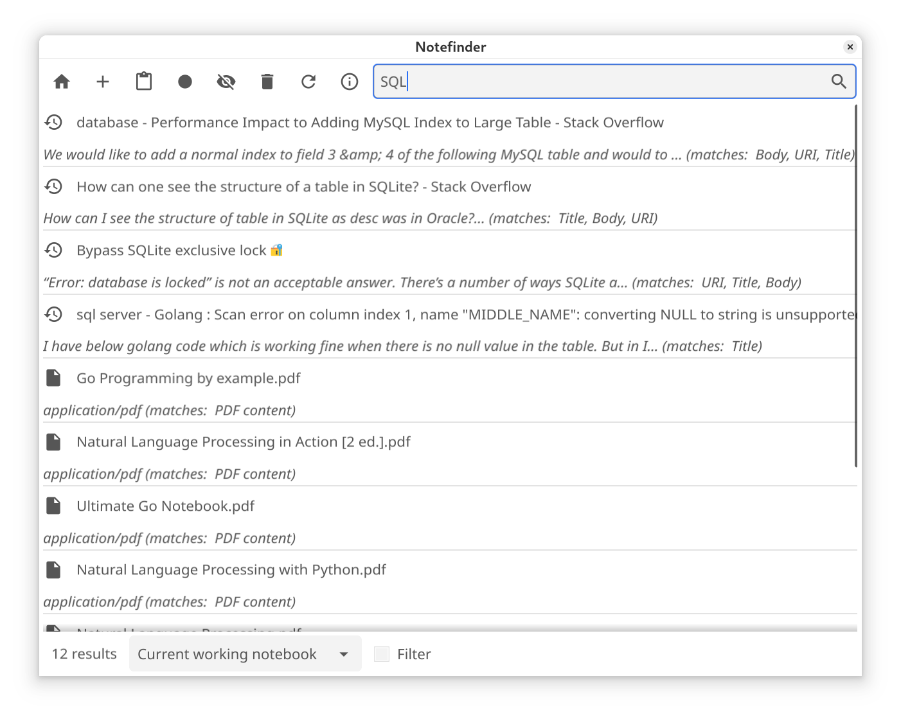

# Notefinder

A note-taking/personal information management application that simplifies keeping, organizing and searching various pieces of data: notes, bookmarks, documents, tasks from different sources in one place.

* Open source and free software
* Written in pure Go
* Extensible with Perl scripts
